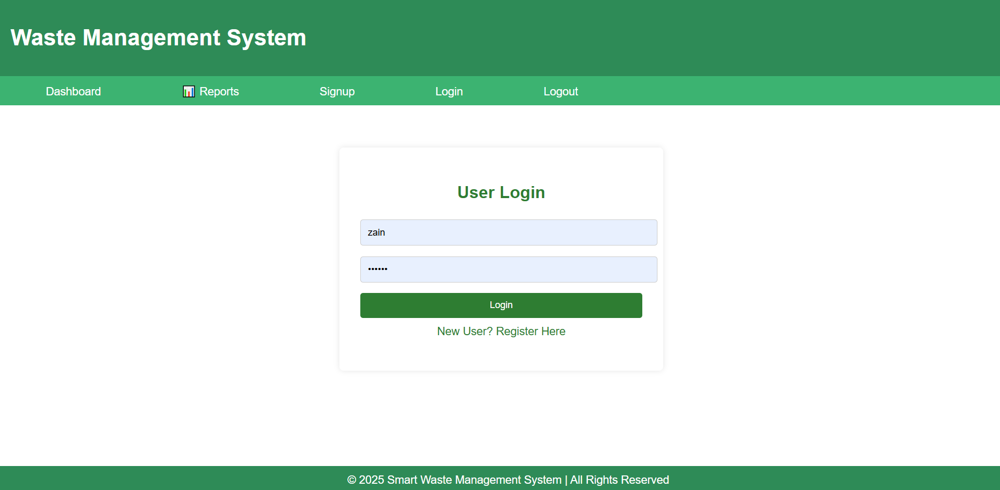
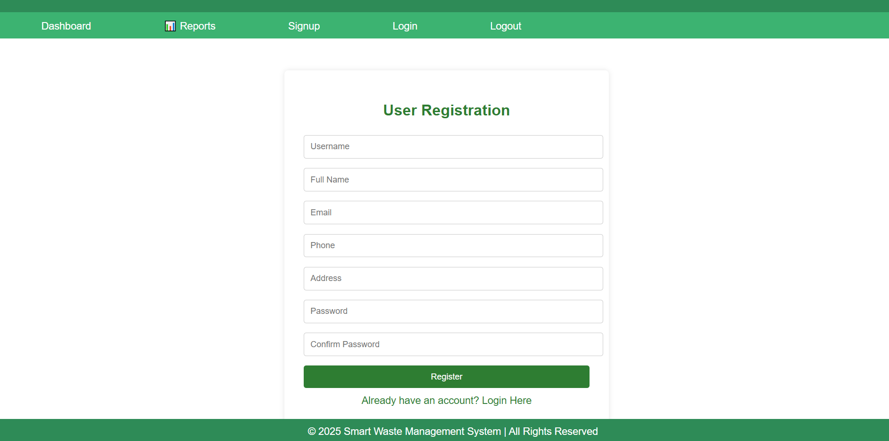
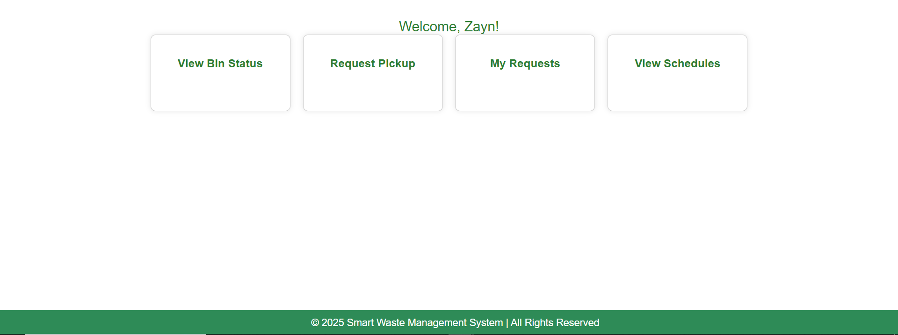
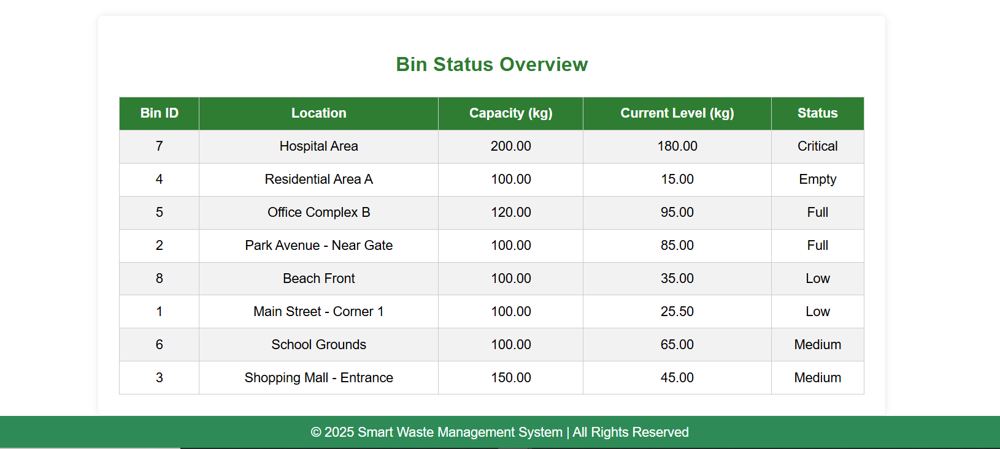
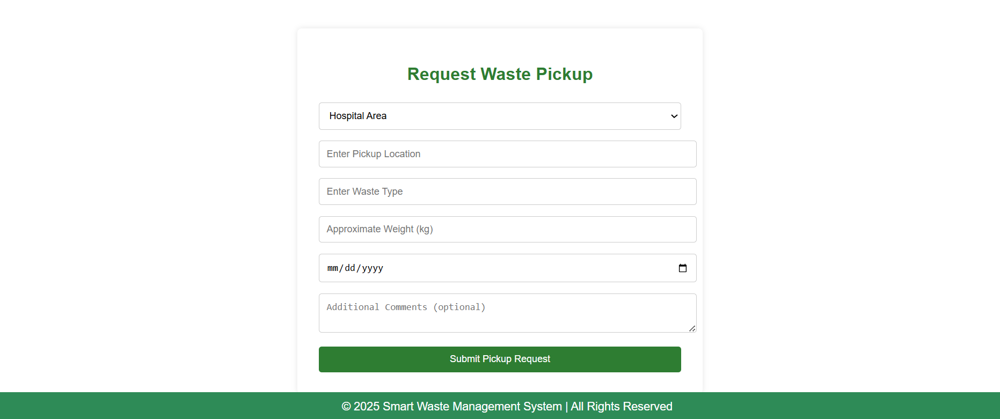
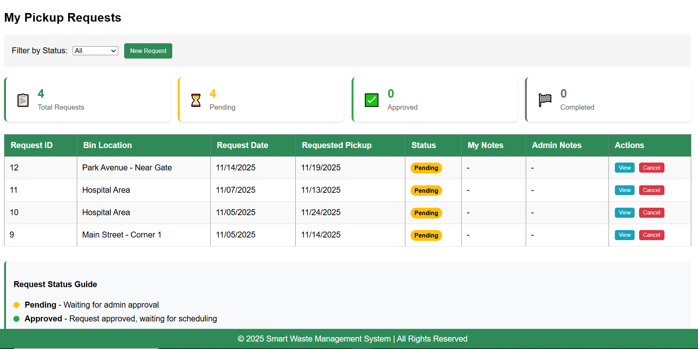
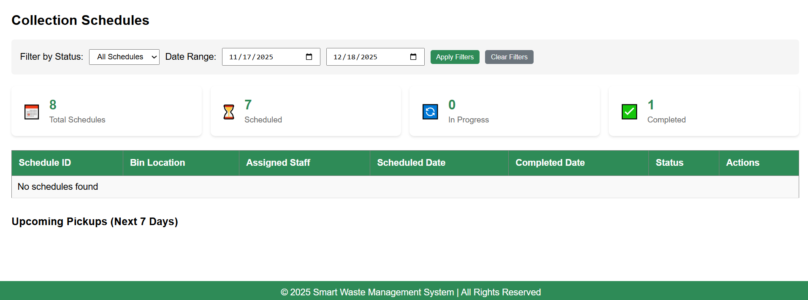

# Smart Waste Management System
The Smart Waste Bin Management System is a web-based application developed using C#, ASP.NET, and the Three-Tier Architecture (Presentation Layer, Business Logic Layer, and Data Access Layer). This project aims to modernize waste collection by introducing intelligent monitoring and real-time management features.

The system allows administrators to manage multiple waste bins installed across different locations. Each bin’s fill-level status (e.g., Empty, Half-Full, Full, Overloaded) is updated and monitored through the dashboard. When a bin reaches a threshold level, the system automatically raises alerts and suggests optimized collection routes for workers.

The application provides features such as bin registration, status updates, location tracking, collection schedule planning, and user authentication. The clean separation of layers ensures improved maintenance, scalability, and reusability of code.

This project demonstrates practical implementation of three-tier software architecture, database integration, visual programming UI design, and real-world problem solving using modern ASP.NET development techniques.
## 📸 Project Output

### Screenshot 1

### Screenshot 2

### Screenshot 3

### Screenshot 4

### Screenshot 5

### Screenshot 6

### Screenshot 7

